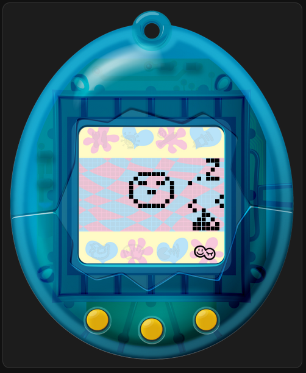

# Tama-Server ESP32

This uses <a href="https://github.com/jcrona/tamalib">TamaLIB</a> to host a tamagotchi server on your ESP32. Using WebSockets you can then connect to it and remotely interact with your Tamagotchi.
This can be useful to run a tamagotchi on clients where it's tricky/impossible to have a tamagotchi running constantly (in the background). This way the tamagotchi will keep running in the background when your client app closes just as you probably would want it to. 

<p></p>
<sup>Home Assistant client card that let you interact with the Tamagotchi server running on an ESP32</sup>

## Included:

### Tama-Server Arduino project (Tama-Server.ino)

Use this to flash your ESP32. Before doing so you will need a rom.h and secrets.h file. Templates are included. 

For getting a rom you can follow the instructions here: https://github.com/jcrona/mcugotchi/

Rename the secrets.h.template to secrets.h and fill in your WiFi credentials.

Once flashed you can check the serial monitor for your IP address. You may need to press the reset button on your ESP32 if it doesn't show first try.


### HTML/JS Tama client (html/index.html & html/js/script.js)

To get this working modify the gateway variable in script.js to connect to your ESP32. If you're just testing locally you can use `ws://YOUR_ESP_IP/ws`.

If you want to run this from a https website you need to use wss instead. To get that working you need to figure out a way to make the connection secure. 

In my specific case I am hosting my website on the same network and was able to set up reverse proxy to my device using Caddy doing something like this in my caddy file:

```
tamagotchi.mydomain.com {
	reverse_proxy 192.168.0.72
}
```

Then you can use `wss://tamagotchi.mydomain.com/ws` as your gateway variable.

Opening the index.html should now correctly stream your tamagotchi ESP server.


### Custom Home Assistant Client card (homeAssistant/tama-ha)

If you want to have a tamagotchi client as a card on your HA dashboard you can!

Move the entire tama-ha folder to `<HA config folder>/www/tama-ha`

Then in HA go to Settings > Dashboards and click Resources from the top right menu.

Add new resource to `/local/tama-ha/tamagotchi-client-card.js`

Then, to add it to your dashboard, edit the raw configuration file like so:

```
views:
  - name: Tama
    cards:
      - type: custom:tamagotchi-client-card
        gateway: wss://tamagotchi.mydomain.com/ws
```

## What's next?

This can be relatively easily expanded to make the ESP32 behave as an actual tamagotchi besides just being a server. 
Just connect a screen and buttons and modify the hal to deal with button input and screen output. 

Audio isn't implemented (yet?)

The ESP32 does not save the state or anything so if it loses power it will reset, so it may be worthwhile to add something there or at least send the state over to the client. 

## License

TamaLIB is distributed under the GPLv2 license. See the LICENSE file for more information.

